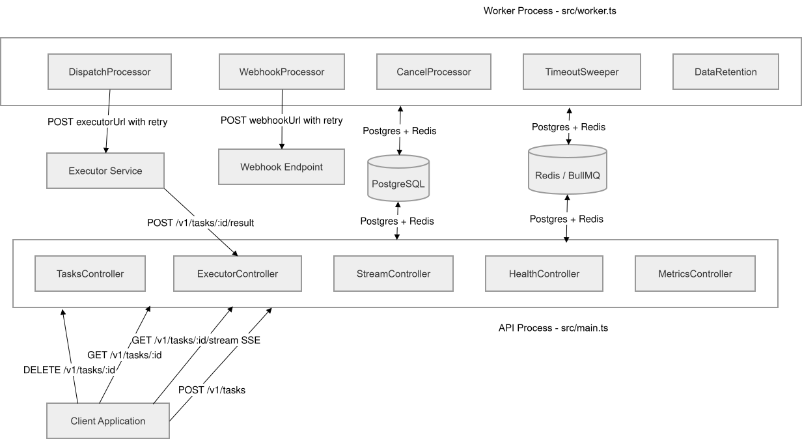
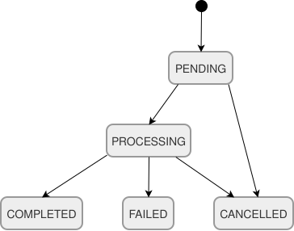
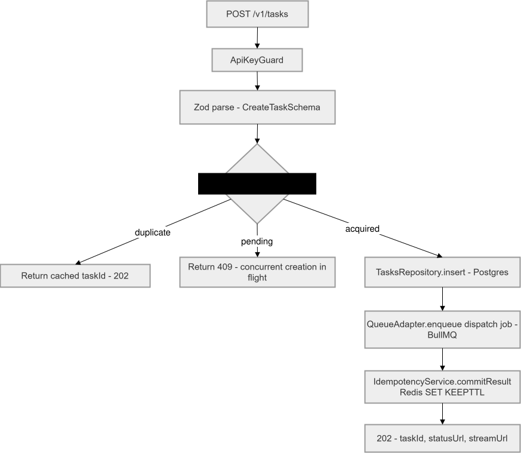
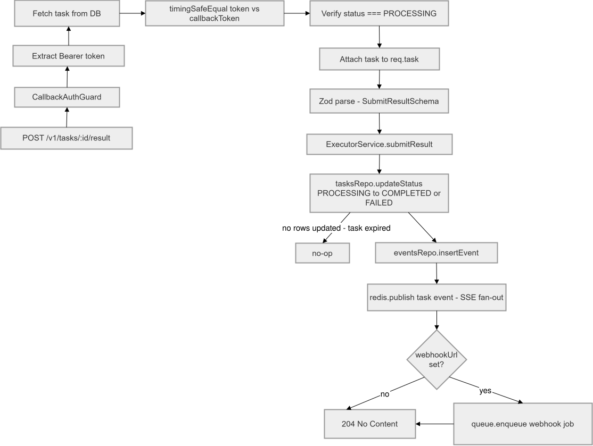

# Architecture

## Table of Contents

- [Overview](#overview)
- [Component Diagram](#component-diagram)
- [Process Separation](#process-separation)
- [Module Breakdown](#module-breakdown)
- [Infrastructure Libraries](#infrastructure-libraries)
- [Database Schema](#database-schema)
- [Request Flows](#request-flows)
- [Validation Strategy](#validation-strategy)
- [Scaling Model](#scaling-model)
- [Security Notes](#security-notes)

---

## Overview

`async-long-request-proxy` is a two-process NestJS application - `API` and `Worker` - that share a codebase but have separate entry points, module graphs, and scaling axes. They communicate through two shared stores:

- PostgreSQL - source of truth for task state, the state machine, and the event log
- Redis - BullMQ job queues, idempotency locks, and Pub/Sub channels for live SSE fan-out

---

## Component Diagram



---

## Process Separation

### API Process (`src/main.ts`)

A standard NestJS HTTP server (Express adapter). Accepts HTTP requests, writes task state to Postgres, enqueues jobs into BullMQ, and returns `202` immediately - never waits for execution.

| Module                | Role                                                      |
| --------------------- | --------------------------------------------------------- |
| `TasksModule`         | Task creation, polling, cancellation                      |
| `ExecutorModule`      | Inbound executor callbacks (result, progress)             |
| `DeliveryModule`      | SSE streaming                                             |
| `ObservabilityModule` | Health and metrics endpoints                              |
| `IdempotencyModule`   | Two-phase Redis lock for `POST /v1/tasks`                 |
| `DrizzleModule`       | Postgres connection and Drizzle ORM                       |
| `RedisModule`         | Shared ioredis client (standalone + Cluster)              |
| `QueueModule`         | BullMQ enqueue-only adapter (no consumers in API process) |

### Worker Process (`src/worker.ts`)

A NestJS application context with no HTTP server. Registers BullMQ consumers and repeatable jobs only.

| Module                 | Role                                                |
| ---------------------- | --------------------------------------------------- |
| `ExecutorWorkerModule` | `DispatchProcessor`, `CancelProcessor`              |
| `DeliveryWorkerModule` | `WebhookProcessor`                                  |
| `MaintenanceModule`    | `TimeoutSweeperProcessor`, `DataRetentionProcessor` |
| `HttpRetryModule`      | HTTP POST with exponential backoff                  |
| `DrizzleModule`        | Shared with API process                             |
| `RedisModule`          | Shared with API process                             |
| `QueueModule`          | BullMQ consumer adapter                             |

Both processes share `env.schema.ts` configuration and connect to the same Postgres and Redis instances.

---

## Module Breakdown

### `src/modules/tasks` - Task Lifecycle Initiator

Handles task creation, status polling, and cancellation.

| File                   | Responsibility                                                                  |
| ---------------------- | ------------------------------------------------------------------------------- |
| `tasks.controller.ts`  | `POST /v1/tasks`, `GET /v1/tasks/:id`, `DELETE /v1/tasks/:id`                   |
| `tasks.service.ts`     | Orchestrates idempotency lock, DB insert, BullMQ enqueue, lock commit           |
| `tasks.repository.ts`  | Drizzle queries: insert, findById, updateStatus (conditional), cancelTask       |
| `schemas/tasks.sql.ts` | Drizzle table definition with `CHECK` constraints and state machine enforcement |

`TasksService.create()` implements a 4-step idempotent creation flow:

```
1. Redis SET NX (occupy slot)
2. Postgres INSERT task
3. BullMQ enqueue dispatch job
4. Redis SET KEEPTTL {taskId} (commit slot)
```

Crashes between steps leave recoverable state - see [ADR-003](adr/003-two-phase-idempotency-lock.md).

### `src/modules/executor` - Executor Contract (Double 202)

The inbound callback surface for executor services. Operates in the API process.

| File                            | Responsibility                                                              |
| ------------------------------- | --------------------------------------------------------------------------- |
| `executor.controller.ts`        | `POST /v1/tasks/:id/result`, `PATCH /v1/tasks/:id/progress`                 |
| `executor.service.ts`           | Conditional DB update, event insert, Redis Pub/Sub publish, webhook enqueue |
| `guards/callback-auth.guard.ts` | Bearer token validation (constant-time) + task state check                  |
| `workers/dispatch.processor.ts` | BullMQ consumer: `PENDING->PROCESSING` + POST executorUrl                   |
| `workers/cancel.processor.ts`   | BullMQ consumer: best-effort POST cancelUrl                                 |

`CallbackAuthGuard` validates the per-task `callbackToken` using `timingSafeEqual` to prevent timing attacks. It also attaches the full task object to `req.task`, eliminating a redundant DB round-trip in the controller.

The `DispatchProcessor` runs in the Worker process. Its error strategy:

- HTTP 4xx from executor - mark task `FAILED` (non-retryable)
- HTTP 5xx / network errors - revert to `PENDING`, re-throw so BullMQ applies backoff
- Infrastructure errors after `PROCESSING` transition - attempt revert to `PENDING`

See [ADR-007](adr/007-dispatch-error-strategy.md) for the full rationale.

### `src/modules/delivery` - Result Delivery to Initiator

Handles SSE streaming and webhook delivery.

| File                           | Responsibility                                            |
| ------------------------------ | --------------------------------------------------------- |
| `stream.controller.ts`         | `GET /v1/tasks/:id/stream` (SSE endpoint)                 |
| `sse.service.ts`               | Event sourcing + Redis Pub/Sub subscriber per connection  |
| `events.repository.ts`         | Drizzle queries on `task_events` table                    |
| `schemas/events.sql.ts`        | Event log table with monotonic `seq` per task             |
| `workers/webhook.processor.ts` | BullMQ consumer: POST webhookUrl with exponential backoff |

SSE uses a subscribe-then-replay strategy to prevent race conditions:

1. Subscribe to `task:{id}` Redis channel
2. Buffer any incoming messages
3. Query DB for history since `afterSeq`
4. Replay history, then drain buffer (deduplicating by seq)
5. Forward live messages as they arrive

A 25-second heartbeat `ping` event keeps connections alive through reverse proxies.

See [ADR-004](adr/004-sse-event-sourcing.md) for the full connection sequence rationale.

### `src/modules/maintenance` - Cross-Cutting Guarantees

Background sweepers that enforce system-level invariants. Runs only in the Worker process.

| File                                   | Responsibility                                                        |
| -------------------------------------- | --------------------------------------------------------------------- |
| `workers/timeout-sweeper.processor.ts` | Cron: expire overdue `PENDING`/`PROCESSING` tasks to `FAILED`         |
| `workers/data-retention.processor.ts`  | Cron: delete terminal tasks + events older than `DATA_RETENTION_DAYS` |
| `maintenance.repository.ts`            | Batch DB operations with `FOR UPDATE SKIP LOCKED` and `LIMIT`         |

---

## Infrastructure Libraries

Each library is a standalone NestJS module with no knowledge of business domains.

### `libs/idempotency` - Two-Phase Redis Lock

```
FREE -> [SET NX -> PENDING_SENTINEL] -> PENDING -> [SET KEEPTTL taskId] -> COMMITTED
```

A Lua script performs the atomic `SET NX + GET` in a single round-trip. This eliminates the race window between two separate Redis operations. See [ADR-003](adr/003-two-phase-idempotency-lock.md).

### `libs/http-retry` - HTTP POST with Exponential Backoff

Retries on 5xx, 429, and known transient network codes (`ECONNREFUSED`, `ETIMEDOUT`, etc.).

- 4xx responses (except 429) throw `NonRetryableError` immediately - no retry can fix a client error
- Each retry adds jitter (up to 200ms) to prevent thundering herd from simultaneous worker failures
- Per-request timeout is configurable (default 10 s)

### `libs/queue` - BullMQ Adapter

`IQueueAdapter` interface abstracts BullMQ. Feature code depends only on the interface token `QUEUE_ADAPTER`. The BullMQ dependency is isolated to `BullMqAdapter`. Each processor creates its own isolated ioredis connection (`createBullMqConnection`) - a BullMQ requirement.

### `libs/redis` - Shared Redis Client

Wraps ioredis. Supports both standalone and Cluster mode. Exposes `createIsolatedClient()` which SSE uses to create a dedicated subscriber connection - ioredis enters subscriber-only mode on `.subscribe()`, blocking general-purpose commands on that connection.

### `libs/observability` - Health and Metrics

- `GET /health/live` - stateless liveness (kubelet: pod is responsive)
- `GET /health/ready` - deep readiness (checks Postgres + Redis; kubelet: pod can serve traffic)
- `GET /metrics` - Prometheus format via `prom-client`

### `libs/logger` - Structured Logger (Pino)

Replaces the NestJS default logger with Pino for structured JSON output.

---

## Database Schema

### `tasks` table

The state machine source of truth. Every status transition is protected by:

1. A `CHECK` constraint on `status` - rejects invalid values at the DB level
2. A `tasks_valid_state_data` `CHECK` - enforces timestamp consistency per state (e.g., `PROCESSING` requires `processingStartedAt IS NOT NULL`)
3. Application-level conditional `UPDATE ... WHERE status = 'PREVIOUS_STATE'` - atomically guards transitions

<p align="center">
  
</p>

Indexes:

- `tasks_status_idx` - general status queries
- `tasks_sweeper_idx` - partial index on `expires_at WHERE status IN ('PENDING', 'PROCESSING')` - hot path for timeout sweeper, minimal index size
- `tasks_idempotency_key_idx` - unique partial index (only for non-null keys)

### `task_events` table

Append-only event log. Never updated, never deleted during task lifetime (only by data retention).

- `seq` is a monotonic per-task counter assigned at insert time
- `(task_id, seq)` unique index prevents duplicate replays
- Used as `Last-Event-ID` for SSE reconnect

---

## Request Flows

### Task Creation



### Executor Result Submission



---

## Validation Strategy

All validation uses Zod exclusively - no `class-validator`.

- `@ParseBody(Schema)` applies `.strict()` by default, rejecting unknown fields. Use `allowUnknown()` for proxied payloads where the schema is intentionally open.
- Schemas are derived from Drizzle table definitions via `drizzle-zod` and extended as needed, keeping DTO and schema in sync without duplication.
- `ZodExceptionFilter` catches `ZodError` and returns RFC 7807 400 responses.

---

## Scaling Model

| Component | Scaling Axis       | Mechanism         |
| --------- | ------------------ | ----------------- |
| API       | CPU / request rate | HPA (Kubernetes)  |
| Worker    | BullMQ queue depth | KEDA ScaledObject |

The API and Worker scale independently. Decoupling allows the Worker to absorb spikes in executor callback volume without requiring API replicas, and vice versa.

Multiple Worker replicas are safe: BullMQ uses `BRPOP` with Redis locks - only one worker processes a given job.

---

## Security Notes

- API key (`PROXY_API_KEY`): static key validated with `timingSafeEqual` to prevent timing attacks. Fail-open if not set.
- Callback token: UUID generated per task at creation. Validated with `timingSafeEqual` on every executor callback. See [ADR-008](adr/008-callback-token-security.md).
- Trust proxy is set to `1` so the API correctly reads client IPs behind a single reverse proxy hop (ALB, nginx).
- Swagger UI is disabled in `production` environments.
